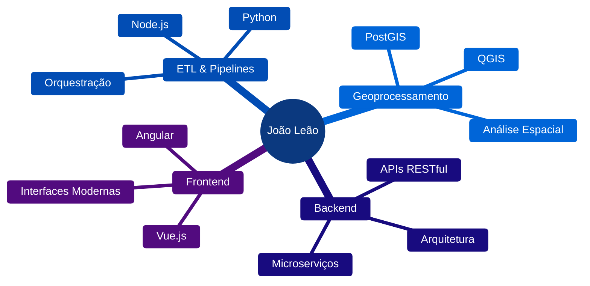

<div align="center">

# 👋 Olá! Eu sou João Leão

### 🌐 Desenvolvedor Full Stack | 🗺️ Especialista em Geoprocessamento | 📊 Engenheiro de Dados

[](https://www.joaoleao.fun/)
[](https://www.linkedin.com/in/jo%C3%A3o-le%C3%A3o-630a94170/)
[](mailto:joaoleaogf@gmail.com)
[](https://github.com/joaoleaogf)

---

### 🌟 [Visite meu Portfólio Interativo](https://www.joaoleao.fun/) 🌟

</div>

---

## 🎯 O que eu faço?

```typescript
const joao = {
  localização: "Itajubá, MG 🇧🇷",
  foco: ["ETL", "Geoprocessamento", "Backend", "Análise Espacial"],
  atualmente: "Transformando dados em insights acionáveis",
  missão: "Conectar tecnologia e geografia para resolver problemas reais",
  portfolio: "https://www.joaoleao.fun/"
};
```

---

## 📊 Estatísticas Completas do GitHub

<div align="center">


</div>

---

## 🛠️ Arsenal Tecnológico

<table align="center">
<tr>
<td align="center" width="25%">

### Backend


</td>
<td align="center" width="25%">

### Frontend


</td>
<td align="center" width="25%">

### Dados & Geo


</td>
<td align="center" width="25%">

### DevOps


</td>
</tr>
</table>

---

## 🚀 Projetos em Destaque

<details open>
<summary><b>🔵 ETL & Geoprocessamento</b></summary>
<br>

### 🩺 [ETL GeoSaúde Itajubá](https://github.com/joaoleaogf/etl-geosaude-itajuba)
> Pipeline ETL robusto para dados de saúde com geocodificação avançada e análise espacial


**Destaques:**
- ✅ Geocodificação inteligente com múltiplas estratégias
- ✅ Normalização automática de endereços
- ✅ Integração completa com QGIS

---

### 🚗 [FIPE ETL](https://github.com/joaoleaogf/fipe-etl)
> Sistema escalável para processamento da Tabela FIPE com orquestração completa


**Destaques:**
- ✅ Arquitetura modular e escalável
- ✅ Processamento incremental e reprocessamento
- ✅ Dockerizado para fácil deploy

---

### 🦠 [Análise Descritiva – Febre Amarela](https://github.com/joaoleaogf/analise-descritiva-febre-amarela)
> Análise epidemiológica com visualização espacial de dados de saúde


**Destaques:**
- ✅ Análise estatística descritiva
- ✅ Visualização de padrões espaciais
- ✅ Processamento de dados epidemiológicos

</details>

<details>
<summary><b>🧠 Algoritmos & Otimização</b></summary>
<br>

### 🏠 [Otimização de Rotas - Recadastramento Imobiliário](https://github.com/joaoleaogf/otimizacao-rotas-recadastramento-imobiliario)
> Solução baseada em teoria dos grafos para otimizar rotas de campo


**Destaques:**
- ✅ Algoritmos de grafos para roteirização
- ✅ Minimização de deslocamentos
- ✅ Visualização de rotas otimizadas

</details>

<details>
<summary><b>🖥️ Aplicações Web Full Stack</b></summary>
<br>

### 📊 [Relatórios Ad-Hoc](https://github.com/joaoleaogf/relatorios-ad-hoc)
> Sistema modular para criação e visualização de relatórios customizados


**Destaques:**
- ✅ Arquitetura componentizada
- ✅ Interface intuitiva e responsiva
- ✅ Exportação em múltiplos formatos

---

### ♻️ [Sistema de Coleta Seletiva](https://github.com/joaoleaogf/Coleta-seletiva)
> Plataforma completa para gestão de coleta seletiva urbana


**Destaques:**
- ✅ Gerenciamento de rotas de coleta
- ✅ API RESTful completa
- ✅ Interface moderna com Vue.js

</details>

<details>
<summary><b>🛠️ Arquitetura & Estudos</b></summary>
<br>

### 🌊 [Node.js Streams](https://github.com/joaoleaogf/NodeJs-Streams)
> Exploração profunda de streams para processamento eficiente de grandes volumes


---

### 🧱 [MVC – Psycopg2 vs SQLAlchemy](https://github.com/joaoleaogf/MVC-psycopg2-vs-SqlAlchemy)
> Comparativo de ORMs em Python com arquitetura MVC


</details>

---

## 💡 Minhas Especialidades



---

<div align="center">

### 💬 "Dados sem localização são apenas números. Com geografia, eles contam histórias." 🗺️

---

### 📫 Vamos conectar?

[](https://www.joaoleao.fun/)
[](https://www.linkedin.com/in/jo%C3%A3o-le%C3%A3o-630a94170/)
[](mailto:joaoleaogf@gmail.com)
[](https://github.com/joaoleaogf)

---


*⭐ Se algum projeto te interessar, deixe uma estrela!*

</div>
